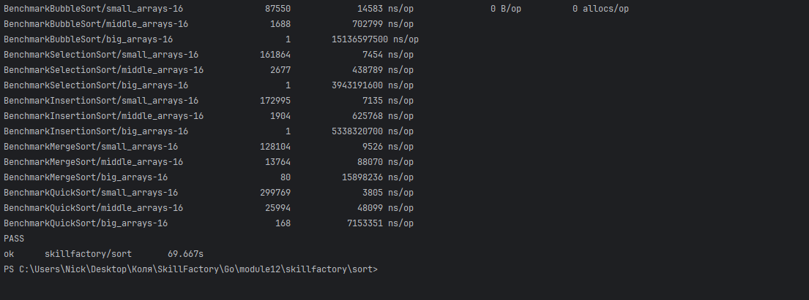

ошибка в 
`ar := generateSlice(10, 100)`

Вместо 100 было задано 10
# Домашнее задание 12.8.1
___

## Задание
1. Написать по образу и подобию бенчи для всех сортировок, которые вы написали.
2. Использовать b.ReportAllocs() и проанализировать, какие алгоритмы потребляют память и как изменяется рост затрат 
памяти. b.ReportAllocs() достаточно вызвать один раз внутри одной функции-теста.
3. Используя данные из примера сравнить производительность всех алгоритмов. Записать данные в виде таблицы:
В ячейках таблицы нужно указать порядок затраченного времени (количество цифр в числе затраченного времени: 
2 для 17нс и 80нс, 4 для 1453нс и 9934нс). В последнем столбце просто + или -.
4. Добавить проверки для других размеров входных данных, отличающихся от примера, попробовать использовать большие и 
меньшие максимальные числа.
5. Придумайте последовательности входных данных, которые представляют собой лучший и худший случай для пары-тройки 
алгоритмов на ваш выбор. Сделайте для них бенчамарки и сравните эффективность.

## Решение
1. Бенчмарки можно посмотреть в файле `sort_test.go`. Выполнены по образу и подобию заданного бенчмарка для сортировки
пузырьком. За исключением случая "small arrays", в котором значение размера массива было увеличено в 10 раз. Данное 
изменение связано с тем, что при размере 10, программа не выходила из расчетов. На видео размер массива также задан 100. 
2. `b.ReportAllocs()` вставлен в код.
3. Таблица 1. Результаты производительности алгоритмов

| Алгоритм      | n=100 | n=1000 | n=10000 | Были ли затраты памяти? |
|---------------|-------|--------|---------|-------------------------|
| bubblesort    | 5     | 6      | 11      | -                       |
| selectionSort | 4     | 6      | 10      | -                       |
| insertionSort | 4     | 6      | 10      | -                       |
| mergeSort     | 4     | 5      | 8       | +                       |
| quickSort     | 4     | 5      | 7       | -                       |

4. В качестве проверок других случаев в каждом алгоритме сортировок добавлено три бенчмарка. 
    - "Max is ten times less than the previous one", где максимальный элемент равен 1, а размер массива 100.
    - "Max is five times greater than the previous one", где максимальный элемент равен 50, а размер массива 100.
    - "Max is fifty times greater than the previous one", где максимальный элемент равен 5000, а размер массива 1000.
   
| Алгоритм      | n=100, max = 1 | n=100, max=10 | n=100, max=50 | n=1000, max=100 | n=1000, max=5000 | n=10000 | Были ли затраты памяти? |
|---------------|----------------|---------------|---------------|-----------------|------------------|---------|-------------------------|
| bubblesort    | -              | 5             | -             | 6               | 6                | 11      | -                       |
| selectionSort | 4              | 4             | 4             | 6               | 6                | 10      | -                       |
| insertionSort | 4              | 4             | 4             | 6               | 6                | 10      | -                       |
| mergeSort     | 4              | 4             | 4             | 5               | 5                | 8       | +                       |
| quickSort     | 4              | 4             | 4             | 5               | 5                | 7       | -                       |

5. В качестве наихудшего случая был выбран массив отсортированный по убыванию, а в качестве алгоритмов сортировки - 
пузырьковая, быстрая и сортировка вставкой.

 | Алгоритм      | n=1000 |
 |---------------|--------|
 | bubblesort    | 6      |
 | insertionSort | 6      |
 | quickSort     | 6      |

В качестве наилучшего - массив отсортированный по возрастанию.

| Алгоритм      | n=1000 |
|---------------|--------|
| bubblesort    | 6      |
| insertionSort | 6      |
| quickSort     | 5      |