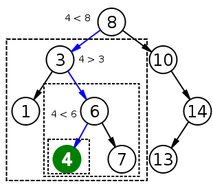
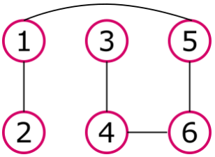
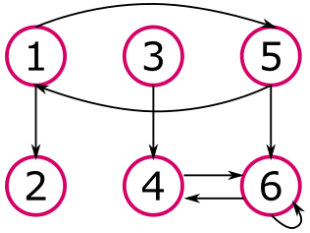

# Домашнее задание 13.11.1

___

## Задание

1. Структура: двоичное дерево.
   Функции: вставка элемента, удаление элемента, поиск элемента,
   печать элементов дерева.
2. Структура: неориентированный граф.
   Функции: поиск в ширину.
3. Структура: ориентированный граф.
   Функции: определения кратчайшего пути между любой парой вершин.

## Решение

1. [Бинарное дерево](https://github.com/MoJIoToK/learning_go/tree/master/module13/tree) -
   это дерево с корнем, в котором каждый узел имеет не более
   двух дочерних элементов. Один из них условно называют левым, другой - правым.
   Особеннсть бинарного дерева заключается в том, что он уже отсоритирован.
   Справа от корня или подкорня узел значение которого больше, слева - меньше.

В данном примере реализовано простейщее бинарное дерево. Более подробную
информацию можно уточнить
[здесь*](https://en.wikipedia.org/wiki/Binary_search_tree)

  

Рис.1. Схема бинарного дерева

### Реализованные функции:

- [Вставка](https://github.com/MoJIoToK/learning_go/blob/master/module13/tree/insert.go)
- [Поиск](https://github.com/MoJIoToK/learning_go/blob/master/module13/tree/find.go)
- [Удаление](https://github.com/MoJIoToK/learning_go/blob/master/module13/tree/delete.go)
- [Печать на экран](https://github.com/MoJIoToK/learning_go/blob/master/module13/tree/show.go)

### Сложность операций:

| Операция | Среднее  | Худший случай |
|----------|----------|---------------|
| Поиск    | O(log n) | n             |
| Вставка  | O(log n) | n             |
| Удаление | O(log n) | n             |

2. [Неориентированный граф](https://github.com/MoJIoToK/learning_go/tree/master/module13/undirected_graph) -
   это это пара (A, E), где A - некое множество элементов, а E - множество неупорядоченных пар, составленных
   из элементов множества A. Проще говоря, это два узла, соединенных между собой ребром.

Рис.2. Схема неориентированного графа

### Реализованные функции:

- Алгоритм поиска в ширину или BFS ([Breadth First Search*](https://en.wikipedia.org/wiki/Breadth-first_search)).
  С его помощью можно определить самый короткий путь от заданного узла до целевого с точки зрения количества узлов,
  входящих в путь.

Рис.3. Пример работы алгоритма BFS

3. [Ориентированный граф](https://github.com/MoJIoToK/learning_go/tree/master/module13/directed_graph) -
   это пара (A, E), где A - некое множество элементов, а E - множество упорядоченных пар, составленных из
   элементов множества A (множество рёбер). Для такого графа важен ещё и порядок следования элементов в
   паре из множества E. Другими словами, это тоже самое что и неориентированный граф, только у ребёр есть
   направление

Рис.4. Схема ориентированного графа

### Реализованные функции:

- Алгоритм поиска в глубину или DFS ([Depth First Search*](https://en.wikipedia.org/wiki/Depth-first_search)).
  С его помощью можно определить самый короткий путь от заданного узла до целевого с точки
  зрения затраченных ресурсов(весов) рёбер, входящих в путь.

Рис.5. Пример работы алгоритма DFS

## Литература

1. Бхаргава, А. Грокаем алгоритмы. Иллюстрированное пособие для
   программистов и любопытствующих. - СПб.: Питер, 2022 - 288 с.
2. https://github.com/TheAlgorithms/Go/tree/master/graph
3. https://github.com/yourbasic/graph
4. https://github.com/steelx/go-graph-traversing/tree/master?tab=readme-ov-file
5. https://github.com/dreddsa5dies/algorithm
6. https://github.com/NineStems/golang-interview/tree/master
7. https://appliedgo.net/bintree/
8. https://github.com/m2omou/go-binary-search-tree?tab=readme-ov-file
9. https://github.innominds.com/dmitryburov/algorithm-practice/tree/master/yandex_practicum/sprint_6/tasks/D

*РКН: иностранный владелец ресурса нарушает закон РФ