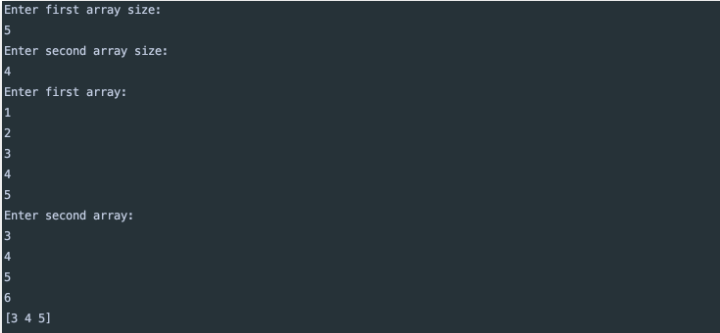

# Homework 14

## Task

Реализуйте программу, которая будет находить общие элементы в двух массивах и использовать map для этой цели.

Программа должна работать таким образом:

1. Вы запускаете программу из консоли: 'go run main.go' или './intersection'.
2. Программа просит ввести размер первого массива (ожидается ввод числа и нажатие каретки (кл. enter)).
3. Программа просит ввести размер второго массива (ожидается ввод числа и нажатие каретки (кл. enter)).
4. Программа просит ввести элементы первого массива, используя перенос строки как разделитель.
5. Когда пользователь заполнит первый массив, программа запрашивает аналогичным образом ввод элементов второго массива.
6. Программа выводит список одинаковых элементов.

Значениями массивов являются строки.

Пример работы с программой:

## Solution

[Решение находится здесь!](https://github.com/MoJIoToK/learning_go/blob/master/module14/task_14.6.1.go)

1. Функция `intersectionWithDoubles()` принимает два входных параметра - два слайса и возвращает один слайс,
   содержащий повторяющиеся элементы. Здесь учитываются дубли которые могут попасться в массивах.
2. Функция `intersectionWithOutDoubles()` принимает два входных параметра - два слайса и возвращает один слайс,
   содержащий повторяющиеся элементы. Здесь не учитываются дубли которые могут попасться в массивах.
   Т.е. в результате будут записаны уникальные одинаковые элементы.
3. Заполнение слайсов происходит в методе `fillArray()`. Где входным параметром является размер слайса,
   а возвращаемым элементом является слайс типа `string`.

## Improvements

В качестве улучшений может быть реализовано следующее:

1. Создание `inputMap` размером равным размеру большего слайса. Но это не было реализовано,
   в связи с тем, что стандартной библиотекой не предусмотрена функция поиска максимального среди типов `int`.
   Конечно можно было бы реализовать это самостоятельно, но смысла захломлять код, я не вижу.
