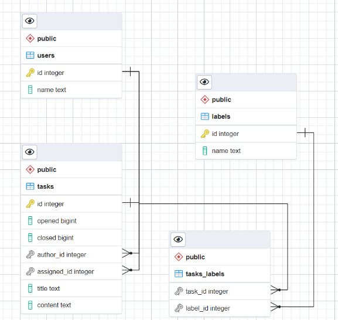

# PostgreSQL App

## Задание

1. Разработать SQL-запрос, который бы создавал БД tasks со следующими таблицами:

- Пользователи
- Метки
- Задачи
  Связь многие-ко-многим между задачами и метками.

ER-диаграмма:

2. Разработать пакет, который бы предоставлял необходимые методы для работы с БД.

API пакета storage должен позволять:
- Создавать новые задачи
- Получать список всех задач
- Получать список задач по автору
- Получать список задач по метке
- Обновлять задачу по id
- Удалять задачу по id.

При этом для простоты таблицы пользователей и меток мы заполним самостоятельно.

## Решение
1. [Создание и заполнение данными БД](https://github.com/MoJIoToK/learning_go/blob/master/module30/tasks_app/schema.sql)

2. [API пакета storage](https://github.com/MoJIoToK/learning_go/tree/master/module30/tasks_app/pkg)
